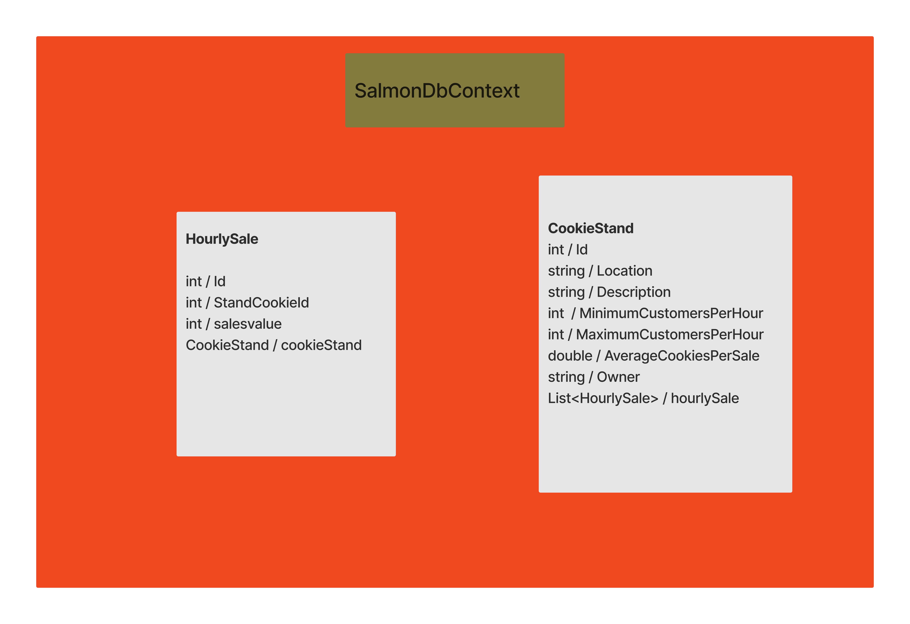

# Salmon Cookie 

This API provides support for Pat's Salmon Cookie Stand application. A number of endpoints are provided to enable you to manage cookie stands, including creating, reading, updating, and deleting the data associated with them. To store and retrieve cookie stand information, the API uses ASP.NET Core and interacts with a database.


### ERD



# Deployed API Swagger  [Swagger](https://cookiestandapi20231005154615.azurewebsites.net/docs/index.html)
### API Endpoints

#### Create a Cookie Stand

- **POST** `/api/cookiestand`

  Creates a new cookie stand with the provided data.

  Request Body (JSON):
  ```json
  {
    
  "location": "A",
  "description": "2",
  "minimumCustomersPerHour": 11,
  "maximumCustomersPerHour": 22,
  "averageCookiesPerSale": 5,
  "owner": "1"

  }
  ```

#### Get All Cookie Stands

- **GET** `/api/cookiestands`

  Retrieves a list of all cookie stands with their data.

    ```json
    [
    {
    "id": 1,
    "location": "A",
    "description": "description3",
    "hourlySale": [
      17,
      14,
      10,
      11,
      8,
      17,
      12,
      16,
      15,
      10,
      12,
      11,
      17,
      6
    ],
    "minimumCustomersPerHour": 11,
    "maximumCustomersPerHour": 22,
    "averageCookiesPerSale": 5,
    "owner": "1"
  }
  ]

  ```


#### Get Cookie Stand by ID

- **GET** `/api/cookiestand/{id}`

  Retrieves a single cookie stand by its unique ID.

```json
{
  "id": 1,
  "location": "A",
  "description": "1",
  "hourlySale": [
    19,
    13,
    10,
    11,
    8,
    17,
    12,
    17,
    15,
    10,
    15,
    11,
    17,
    6
  ],
  "minimumCustomersPerHour": 11,
  "maximumCustomersPerHour": 22,
  "averageCookiesPerSale": 5,
  "owner": "1"
}
```
  

#### Update Cookie Stand

- **PUT** `/api/cookiestand/{id}`

  Updates an existing cookie stand with the provided data. Requires the ID to be included in the request body.

    Request Body (JSON):
  ```json
  {
    
  "location": "B",
  "description": "1",
  "minimumCustomersPerHour": 11,
  "maximumCustomersPerHour": 22,
  "averageCookiesPerSale": 5,
  "owner": "1"

  }
  ```
  


#### Delete Cookie Stand

- **DELETE** `/api/cookiestand/{id}`

  Deletes a cookie stand by its unique ID.

